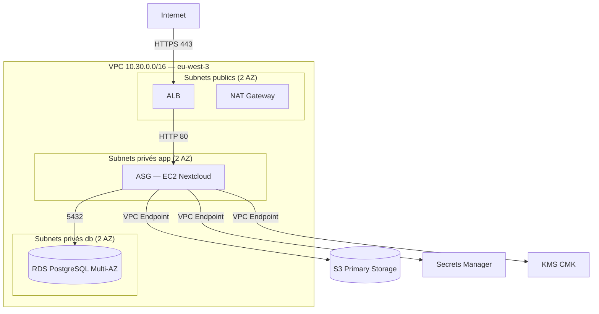

# Architecture — Kolab Nextcloud sur AWS

## Schéma général

## Décisions d'architecture

- **Single NAT Gateway** : en environnement `dev`, un seul NAT Gateway suffit pour réduire les coûts (~32$/mois par NAT). En production, un NAT par AZ serait nécessaire pour la haute disponibilité.
- **ASG min/max = 1** : le TP vise la démonstration fonctionnelle. L'ASG est présent pour préparer le passage en production — il suffit d'augmenter `min_size` et `max_size`.
- **Certificat self-signed** : généré par le provider `tls` pour activer HTTPS sans domaine enregistré. En production, on utiliserait ACM avec un domaine Route53.
- **VPC Endpoints** : S3, Secrets Manager et KMS sont accessibles via endpoints privés — le trafic ne sort jamais sur Internet, ce qui renforce la sécurité RGPD.
- **RDS Multi-AZ** : haute disponibilité et zéro perte de données en cas de défaillance d'une AZ.
